# Product Requirement Document (PRD)
## Bank NumberShield: Automated Telecom SIM Recycling Protection & Banking Fraud Shield Platform

**Document Version:** 3.0.0  
**Status:** Approved for Technical Architecture, Backend Implementation & Git Deployment  
**Target Audience:** Engineering, Product, Security Operations, Compliance, and Executive Stakeholders  
**Date:** August 17, 2026  

---

## 1. Executive Summary & Vision

**Bank NumberShield** is an enterprise-grade banking security and automated identity protection platform engineered specifically for financial institutions. 

In modern telecommunications, phone numbers of deactivated subscribers are routinely recycled and reallocated to new mobile users. When a bank customer loses or abandons a phone number that remains linked to their bank account, the new owner of that mobile number can inadvertently or maliciously receive One-Time Passwords (OTPs), SMS banking alerts, and gain unauthorized access to Net Banking and Unified Payments Interface (UPI) accounts.

**Bank NumberShield** solves this critical vulnerability by connecting bank core identity systems directly with telecom SIM allocation and Aadhaar/Government verification data feeds. Upon SIM reallocation, the platform automatically deregisters the phone number within **1 hour**, alerts the customer via alternate verified channels, freezes sensitive banking operations to prevent fraud, and provides a secure, temporary self-service recovery portal for the customer while giving bank employees centralized tracking and operations controls.

---

## 2. Key Problem Statement & Core Objectives

### The Problem
- **Recycled SIM Risk:** Telecom operators recycle inactive mobile numbers after 90 days. When a new user completes Aadhaar verification and receives a recycled SIM, they inherit access to SMS OTPs and banking alerts for the previous subscriber's bank account.
- **Delayed Deregistration:** Traditional banks rely on customers manually updating their phone numbers, leaving a window of vulnerability ranging from weeks to months.
- **Account Takeover Fraud:** Fraudsters exploit recycled SIMs and SIM swaps to initiate unauthorized funds transfers, take out instant digital loans, and compromise credit/debit cards.

### Core Objectives
1. **< 1-Hour SLA Deregistration:** Deactivate net banking, UPI, and SMS banking from recycled numbers within 60 minutes of new SIM activation.
2. **Proactive Outreach:** Instantly identify customer alternate numbers via secure Aadhaar/CKYC vaults and alert the customer before fraud occurs.
3. **Zero Friction Recovery:** Enable customers to safely re-register their primary banking number using verified alternate contact methods via a temporary recovery portal that automatically revokes access once resolved.
4. **Employee Operations Portal:** Provide bank security and operational staff with a dedicated portal for tracking SIM recycling events, fraud velocity scores, and account status overrides.

---

## 3. User Personas

| Persona | Role | Primary Goals & Needs |
| :--- | :--- | :--- |
| **Bank Security / Ops Employee** | Bank Employee / Fraud Analyst | Wants a dedicated dashboard (`/employee-login.html`) to monitor real-time SIM recycling alerts, view account risk scores, manage manual overrides, and inspect flagged transactions. |
| **Bank Customer (Impacted)** | Existing Account Holder | Wants immediate notification if their old mobile number is reassigned, seamless temporary portal access (`/customer-login.html`) using an alternate number to secure their account, and simple re-registration. |
| **New Mobile Subscriber** | Unintended Recipient of Recycled SIM | Prevented from receiving confidential banking OTPs or messages intended for the prior owner of the mobile number. |
| **Automated System / Identity Vault** | System Service (Aadhaar/CKYC/Telecom Feed) | Continuous background listener processing SIM activation events and matching them against the bank's account database. |

---

## 4. Functional Requirements & Feature Specifications

### 4.1. Automated SIM Reallocation Detection & 1-Hour Deregistration
- **FR-1.1 Real-Time Ingestion:** System must continuously ingest SIM activation & Aadhaar verification events from telecom registries (e.g. DoT / TAFCOP / Telecom SIM recycling feeds).
- **FR-1.2 Identity Matcher:** Match the newly activated SIM number against the bank's active Core Banking System (CBS) primary mobile number database.
- **FR-1.3 Automated Deregistration Execution:** If a match is detected:
  - Immediately revoke SMS OTP delivery to the deactivated number.
  - Deregister the number from UPI handles, mobile banking apps, and SMS banking services.
  - Complete all deregistration procedures within a strict **1-hour SLA** from the timestamp of the new SIM activation.
- **FR-1.4 Audit Logging:** Log every deregistration event with a cryptographically signed timestamp, old customer ID, new subscriber hash, and system execution status.

### 4.2. Alternate Contact Identification & Proactive Customer Alerts
- **FR-2.1 Alternate Number Discovery:** Utilizing bank-authorized Aadhaar Vault and CKYC records (pre-authorized during account onboarding), automatically look up verified alternate contact channels (alternate phone number, emergency contact number, verified email address).
- **FR-2.2 Multi-Channel Alert Engine:** Dispatch automated urgent security alerts via:
  - Encrypted SMS to the verified alternate phone number.
  - Email notification with security instructions.
  - In-App push notification (if logged in on a secondary trusted device).
- **FR-2.3 Alert Content:** Inform the customer that their previous mobile number (`XXXXXX1234`) was reallocated, banking services on that number have been safely deactivated, and provide a secure link to the temporary recovery portal.

### 4.3. Customer Re-Registration & Feedback System
- **FR-3.1 Alternate Number Re-Registration:** Allow the customer to designate their alternate number as their primary banking mobile number.
- **FR-3.2 Biometric / eKYC Re-Verification:** Require video eKYC, facial match, or biometric OTP verification before finalizing the phone number update.
- **FR-3.3 Customer Feedback & Rating Engine:** Post-resolution, display an interactive feedback modal allowing customers to rate the resolution experience, report any unauthorized attempts, and submit qualitative feedback to improve bank services.

### 4.4. Automated Account & Card Controls (Proactive Security Restrictions)
- **FR-4.1 Account Freeze Rules:** Automatically place accounts associated with deregistered numbers into a **"Security Restrict"** state.
- **FR-4.2 Service Restrictions:**
  - Block high-value outbound transactions (NEFT/RTGS/IMPS/UPI) exceeding pre-set threshold (e.g., > $50 / ₹2,000).
  - Temporarily lock linked Debit Cards and Credit Cards for online e-commerce transactions.
  - Disable password reset attempts via SMS OTP.
- **FR-4.3 One-Click Customer Restore:** Allow customers in the temporary portal to unblock their cards and accounts after completing identity verification.

### 4.5. AI Fraud Transaction Engine & Continuous Tracking Mode
- **FR-5.1 Velocity & Behavioral Risk Scoring:** Analyze real-time transaction requests against historical spending patterns, device IDs, IP geolocation, and SIM age.
- **FR-5.2 Automated Tracking Mode:** Accounts marked in "Tracking Mode" are subjected to:
  - Enhanced scrutiny on all incoming and outgoing funds.
  - Real-time fraud detection alerts sent to the bank employee operations dashboard.
  - Auto-blocking of suspicious transactions originating from new devices or unknown IP ranges.

### 4.6. Identity Data Integration & Govt Document Compliance
- **FR-6.1 Direct Govt/Aadhaar Vault Access:** Leveraging existing statutory banking authority for KYC and identity verification, read alternate numbers directly from internal bank Aadhaar Data Vaults without prompting users for redundant API consents.
- **FR-6.2 Privacy & Regulatory Compliance:** Ensure full compliance with RBI Cybersecurity Guidelines, PCI-DSS v4.0, and DPDP / GDPR regulations. All stored PII numbers must be tokenized or masked.

### 4.7. Value-Add Security Features
- **FR-7.1 SIM-Swap Fraud Shield:** Differentiate between normal carrier porting, SIM swaps, and full mobile number reallocation.
- **FR-7.2 Tokenized Virtual Card Issuance:** Provide customers with single-use tokenized virtual cards while their main physical card is under temporary security freeze.
- **FR-7.3 FIU / Cyber Police Auto-Reporting:** Automatically generate standardized incident reporting payloads for bank compliance teams in case of confirmed fraudulent SIM-swap attempts.

### 4.8. Dual Portal Architecture & Authentication
- **FR-8.1 Bank Employee Operations Portal (`/employee-login.html`):**
  - Secure staff login requiring Employee ID, Department, Password, and Hardware MFA PIN.
  - Real-time queue of recycled SIM alerts, account lock statuses, and fraud scores.
  - Manual override tools to unlock accounts, re-send verification links, or escalate suspicious activity.
  - Analytics panel displaying average deregistration time, customer recovery rates, and feedback metrics.
- **FR-8.2 Customer Temporary Recovery Portal (`/customer-login.html`):**
  - Accessible via Alternate Mobile Number + Aadhaar Last 4 Digits + One-Time OTP.
  - Clean, frictionless UI showing current security status of their bank account.
  - Step-by-step wizard to verify identity, update primary number, unblock cards, and submit feedback.
  - **Automatic Session Expiry:** The moment the customer completes resolution or logs off, temporary portal access is **automatically terminated and revoked** for maximum security.

---

## 5. Backend REST API Architecture & Endpoints

The backend is built using Node.js & Express.js with the following endpoints:

| Endpoint | Method | Input Parameters | Description |
| :--- | :--- | :--- | :--- |
| `/api/auth/employee-login` | `POST` | `empId, password, department` | Authenticates bank employees |
| `/api/auth/customer-temp-login` | `POST` | `alternateMobile, aadhaarLast4, otp` | Authenticates customer temporary recovery portal |
| `/api/sim-events/feed` | `GET` | - | Returns real-time SIM recycling queue |
| `/api/sim-events/trigger` | `POST` | - | Ingests new SIM reallocation event |
| `/api/account/reregister-number` | `POST` | `customerId, newPrimaryNumber` | Updates customer primary number |
| `/api/account/card-controls` | `POST` | `action, customerId` | `UNBLOCK` or `FREEZE_ALL` cards |
| `/api/feedback/submit` | `POST` | `customerName, rating, comments` | Saves customer CSAT review |
| `/api/feedback/metrics` | `GET` | - | Returns CSAT score & feedback list |
| `/api/health` | `GET` | - | Health check & PCI-DSS metric |

---

## 6. System Architecture & Workflows

```mermaid
sequenceDiagram
    autonumber
    actor Telecom as Telecom / Aadhaar Registry
    participant Engine as Bank NumberShield Express API
    participant CBS as Core Banking Database
    participant Customer as Customer Recovery Portal
    participant Staff as Staff Operations Portal

    Telecom->>Engine: POST /api/sim-events/trigger (New Aadhaar SIM Event)
    Engine->>CBS: Match Old Mobile Number against Accounts
    CBS-->>Engine: Customer Record Found (Old Num, Alt Num, Aadhaar Vault ID)
    
    rect rgb(30, 45, 65)
        note over Engine, CBS: 1-Hour SLA Automation Window
        Engine->>CBS: Execute Deregistration (Revoke OTP, Disable UPI/NetBanking)
        Engine->>CBS: Place Account in "Security Restrict & Tracking Mode"
    end

    Engine->>Customer: Alert via SMS/Email to Alternate Number
    Engine->>Staff: Push SIM Event to Operations Queue (/api/sim-events/feed)

    alt Customer Self-Service Recovery
        Customer->>Engine: Login at /customer-login.html (Alt Number + OTP)
        Customer->>Engine: POST /api/account/reregister-number
        Customer->>Engine: POST /api/account/card-controls (Restore Access)
        Customer->>Engine: POST /api/feedback/submit
        Engine->>CBS: Update Primary Mobile & Restore Account
        Engine->>Customer: Terminate Session Token (Access Revoked)
    else Staff Manual Override
        Staff->>Engine: Inspect & Manual Unlock Account
    end
```

---

## 7. Security, Privacy & Compliance Standards

| Security Requirement | Specification |
| :--- | :--- |
| **Data Encryption** | AES-256-GCM for data at rest; TLS 1.3 for data in transit. |
| **PII Tokenization** | All phone numbers, Aadhaar numbers, and account numbers must be format-preserving tokenized in logs and analytics databases. |
| **Authentication** | Employee Portal requires OAuth2/OIDC + FIDO2 Hardware Key; Customer Recovery Portal requires Dual-Factor OTP + Biometric Verification. |
| **Compliance Standards** | PCI-DSS v4.0 Level 1, RBI Cyber Security Framework for Banks, UIDAI Aadhaar Vault Compliance, DPDP Act 2023. |
| **Session Security** | Single-use temporary access tokens for customer portal with maximum 15-minute inactivity timeout. |

---

## 8. Success Metrics & Key Performance Indicators (KPIs)

1. **Deregistration Speed:** 100% of recycled SIM events deregistered from banking services within **< 45 minutes** (target SLA is 1 hour).
2. **Account Takeover Reduction:** 99.9% reduction in recycled SIM-related fraud incidents.
3. **Customer Resolution Rate:** > 85% of affected customers successfully update their primary number via the temporary portal within 24 hours.
4. **Customer Satisfaction (CSAT):** > 4.5 / 5.0 rating on the post-resolution feedback module.
5. **Employee Efficiency:** < 2 minutes average handling time per flagged incident on the Bank Employee Operations Portal.
